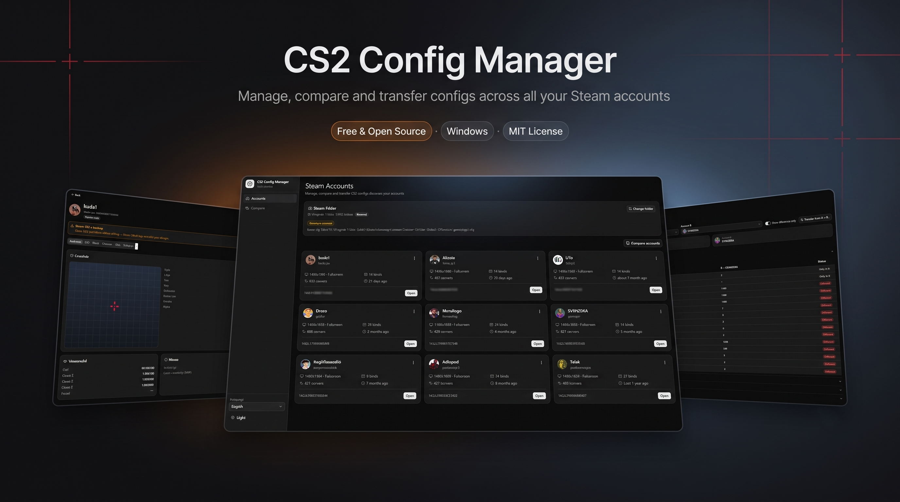

# CS2 Config Manager



Um app desktop gratuito e open source para gerenciar configs de Counter-Strike 2 em múltiplas contas Steam.

Feito com **Tauri 2** (backend em Rust) + **React 19 / Vite / Tailwind CSS v4** (frontend). Somente Windows (por enquanto).

[English](README.md) · **Português (BR)**

## Funcionalidades

- **Detecção automática da Steam** — encontra sua instalação da Steam pelo registro (com opção de escolher a pasta manualmente se a detecção falhar).
- **Todas as suas contas em uma tela** — lista todas as contas Steam com configs de CS2 em `userdata/`, com avatares (cache local de avatares da Steam, com fallback para a Steam Web), última partida, resolução e contagem de binds/convars.
- **Veja o que tem dentro de uma config** — configurações de vídeo (resolução, taxa de atualização, modo de exibição, MSAA, NVIDIA Reflex, níveis de qualidade), crosshair (com **preview ao vivo em canvas**), viewmodel, sensibilidade do mouse, radar/HUD e binds de teclas.
- **Edite com segurança** — editores amigáveis para crosshair/vídeo/viewmodel/mouse, editor completo de binds, tabela de convars com busca e um editor de texto puro para os quatro arquivos de config.
- **Transfira configs entre contas** — copie vídeo/convars/binds (ou tudo) de uma conta para outra em dois cliques. Perfeito para quando você entra numa conta secundária e tudo volta ao padrão.
- **Compare contas** — diff lado a lado das configs de duas contas, agrupado por categoria, com filtro "somente diferenças".
- **Veja suas screenshots da Steam** — as capturas de CS2 da conta (F12 da Steam) em uma aba de galeria dentro do perfil.
- **Vá direto para a pasta cfg** — um clique no menu ⋯ da conta ou no cabeçalho do perfil abre `userdata/<accountId>/730/local/cfg` no Explorer.
- **Backups automáticos** — toda operação de escrita (editar, transferir, restaurar) primeiro tira um snapshot dos arquivos atuais. Snapshots manuais e restauração em um clique incluídos.
- **Aviso de Steam Cloud** — o app detecta quando a Steam/CS2 está rodando e avisa antes de escrever (a Steam Cloud pode sobrescrever mudanças feitas com o jogo aberto).
- **i18n** — English e Português (Brasil), mais idiomas são bem-vindos.

## Download

Baixe o instalador Windows mais recente (`*-setup.exe`, NSIS) em [Releases](../../releases).

> **Importante:** feche o CS2 (e de preferência a Steam) antes de editar ou transferir configs. A sincronização da Steam Cloud pode sobrescrever mudanças feitas enquanto o jogo está aberto. O app avisa quando detecta um dos dois processos.

> **Aviso do Windows (SmartScreen):** o instalador ainda não tem assinatura de código (certificados são caros — este é um projeto gratuito), então o Windows mostra uma tela vermelha de *"O Windows protegeu o computador"* na primeira execução. Clique em **Mais informações → Executar mesmo assim**. Pretendemos obter assinatura gratuita para open source (SignPath) para remover esse aviso.

## Onde ele escreve?

- **Lê/escreve configs de CS2** apenas dentro de `Steam/userdata/<accountId>/730/local/cfg/` (os quatro arquivos: `cs2_video.txt`, `cs2_user_convars_0_slot0.vcfg`, `cs2_user_keys_0_slot0.vcfg`, `cs2_machine_convars.vcfg`). Também **lê** (nunca escreve) as capturas de CS2 em `Steam/userdata/<accountId>/760/remote/730/screenshots/`.
- **Backups e configurações** ficam na pasta de dados do app: `%APPDATA%/com.cs2configmanager.app/` (`cs2-backups/<accountId>/<timestamp>/` e `settings.json`).
- Toda escrita é atômica (arquivo temporário + rename) e precedida de um backup quando o arquivo de destino já existia.
- Os dois arquivos sincronizados com a Steam Cloud (`cs2_user_convars_0_slot0.vcfg` e `cs2_user_keys_0_slot0.vcfg`) também têm os siblings `_lastclouded` atualizados com o mesmo conteúdo — sem isso, a sincronização da nuvem do CS2 reverte mudanças externas na próxima abertura do jogo.

## Desenvolvimento

### Pré-requisitos

- **Node.js 22+** e npm
- **Rust** (stable, via [rustup](https://rustup.rs/))
- **Microsoft C++ Build Tools** (Windows) — instale pelo Visual Studio Installer com a workload **"Desenvolvimento para desktop com C++"**
- **WebView2** — já presente em Windows 10/11 atualizados

> **Pegadinha do Windows + Git Bash:** rode `cargo` / `npm run tauri dev` pelo **cmd.exe ou PowerShell**, não pelo Git Bash. O Git Bash tem seu próprio `link.exe` (GNU coreutils) que sombreia o linker do MSVC no `PATH` e quebra o build com `link: extra operand ...`. No cmd/PowerShell, o rustc encontra o linker do MSVC automaticamente pelo registro — sem precisar de `vcvars`.

> **Windows 11 — Smart App Control:** se `cargo build/test` falhar com `error 4551 (An Application Control policy has blocked this file)` ao rodar build scripts, o **Smart App Control** está bloqueando executáveis não assinados recém-compilados. Desative em *Segurança do Windows → Controle de aplicativo e navegador → Configurações do Smart App Control → Desativado* (chave sem volta — padrão em máquinas de dev). Ele também bloqueia a execução do binário não assinado do app, então o `tauri dev` local exige que esteja desativado.

### Comandos

```bash
npm install        # instala as dependências do frontend
npm run dev        # só o frontend (Vite, http://localhost:5173) — UI sem backend
npm run tauri dev  # app desktop completo com hot reload
npm run tauri build # build de produção + instalador NSIS (src-tauri/target/release/bundle)
npm run typecheck  # checagem de TypeScript
cargo test --manifest-path src-tauri/Cargo.toml  # testes unitários do Rust (parser VDF, matemática de SteamID)
```

### Estrutura do projeto

```
src/                 Frontend (React 19, Vite, Tailwind v4, react-router, react-i18next)
  components/ui/     componentes shadcn/ui (radix)
  components/layout/ shell do app (sidebar, toggle de tema, seletor de idioma)
  features/          accounts (lista), account-detail (abas), compare (diff)
  i18n/locales/      pt-BR.json, en.json
  lib/               api.ts (wrappers dos comandos Tauri), types.ts (contratos dos comandos)
src-tauri/           Backend em Rust (comandos Tauri: detecção da Steam, parsing VDF, backups, diff, transferência)
```

## Internacionalização (i18n)

As strings da UI ficam em `src/i18n/locales/<lang>.json`. Para adicionar um idioma:

1. Copie `en.json` para `<seu-idioma>.json` e traduza os valores.
2. Registre-o em `SUPPORTED_LANGUAGES` em `src/i18n/index.ts`.
3. Abra um PR — só isso.

## Processo de release

Os releases são buildados pelo GitHub Actions (`.github/workflows/release.yml`): suba uma tag como `v0.2.0` e o workflow produz um release em rascunho com o instalador NSIS para Windows.

## Roadmap

- [ ] Importar/exportar share-code de crosshair (`CSGO-…`)
- [ ] Editor da pasta cfg compartilhada do jogo (`autoexec.cfg`, cfgs de treino)
- [ ] Ícone próprio do app (atualmente o ícone padrão do Tauri — rode `npx tauri icon <png>` para trocar)
- [ ] Builds para Linux/macOS (Steam nessas plataformas)

## Origem

Este app foi extraído do lowlights (um gerador local de highlights de CS2), onde o gerenciador de configs nasceu como uma feature. Agora é um projeto standalone para qualquer jogador de CS2 usar.

## Licença

[MIT](LICENSE) © brunobach
